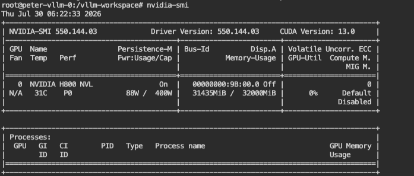
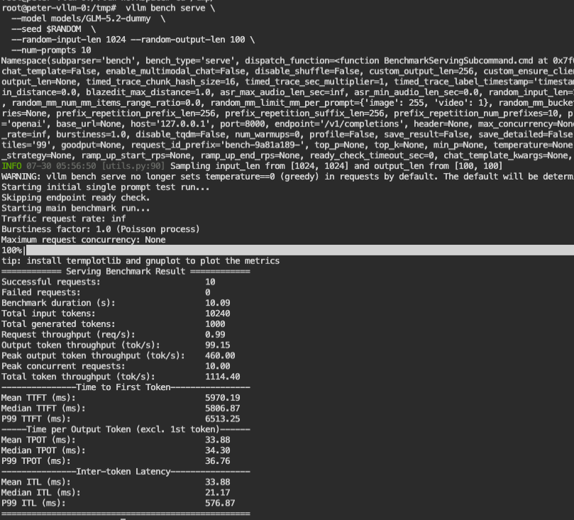
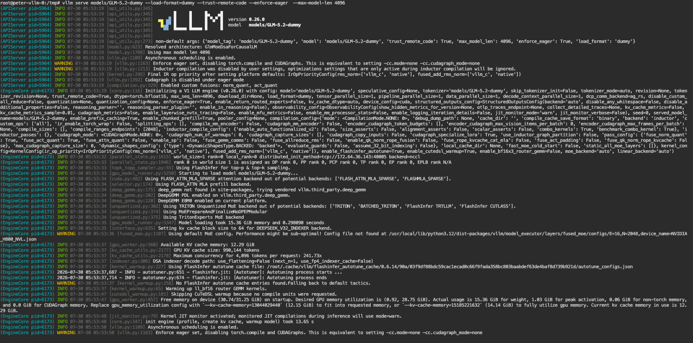
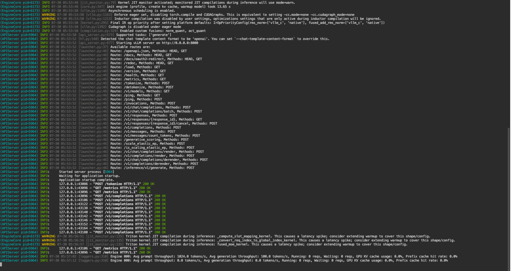
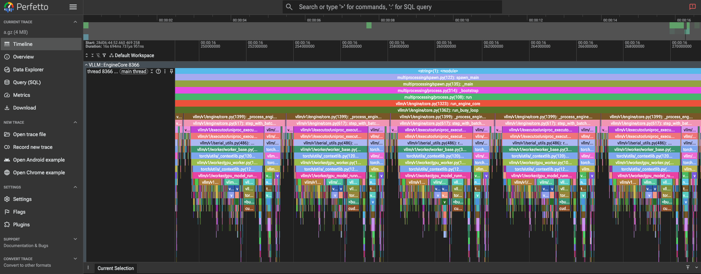

# PocketInfer

[English](README.md)

**Kimi K3 的开发，不必再排队等 B300。**<br>
PocketInfer 帮你把 **2.8T 参数模型**，缩到 **单卡 32 GB** 里做推理开发。

大家都知道 `--load-format dummy` 可以跳过真实权重，但 vLLM 仍会按照原始配置构造完整的张量形状。对于约 2.8T 参数的 Kimi K3，权重可以是假的，显存占用却不会凭空消失——单卡依然装不下。

手工删层、减 attention heads 或 experts 也不可靠：模型可能悄悄绕开目标 cache、MoE 或 kernel path。服务虽然启动了，测到的却不再是你想验证的架构。

PocketInfer 读取官方 Hugging Face 配置和显存预算，生成一个**口袋模型**：规模更小，但仍满足关键架构约束。它继续走 vLLM 原生模型实现，可用于模型接入、scheduler、prefix cache、MoE routing、量化和 kernel 开发。

> [!IMPORTANT]
> 口袋模型是保留关键架构约束的迷你模型，不是把完整的 2.8T 参数原封不动塞进 32 GB。PocketInfer 不是量化、蒸馏或模型压缩，也不会生成可用于效果评测的权重。

## 已跑通：单卡 32 GB GLM-5.2

在仓库根目录执行：

```bash
vllm serve ./models/GLM-5.2-dummy \
  --load-format dummy \
  --trust-remote-code \
  --skip-tokenizer-init \
  --max-model-len 4096
```

这个内置配置已在 vLLM 0.26.0、单卡 32 GB 环境中实际启动：

| 实测项 | 结果 |
| --- | --- |
| 模型与服务 | `GlmMoeDsaForCausalLM` 完成构造，API 服务正常启动 |
| 推理后端 | `FLASH_ATTN_MLA_SPARSE`、FlashAttention MLA prefill、Triton MoE |
| 显存占用 | 模型 15.36 GiB，KV Cache 12.29 GiB；整卡占用 31,435 / 32,000 MiB |

<table>
<tr>
<td width="50%" valign="top">
<a href="docs/assets/runtime-evidence/glm52-single-32gb-memory.png"></a>
<br><sub>单卡显存：31,435 / 32,000 MiB。</sub>
</td>
<td width="50%" valign="top">
<a href="docs/assets/runtime-evidence/glm52-vllm-bench-serve.png"></a>
<br><sub>vLLM bench serve：10/10 请求成功，0 失败。点击查看原图。</sub>
</td>
</tr>
</table>

<details>
<summary><strong>查看完整启动日志（两张截图）</strong></summary>





</details>

<details>
<summary><strong>查看 Profiling（一张截图）</strong></summary>



</details>

这组证据说明 vLLM 不仅完成了模型构造和服务启动，还实际执行了多次 prefill/decode 请求。压测环境额外包含上游 tokenizer 元数据，仅用于构造请求；PocketInfer 本身仍只读取 `config.json`。

> [!NOTE]
> 这里使用 dummy 权重。吞吐与时延只描述这次工程验证，不能代表真实 GLM-5.2 的模型质量或生产性能。

## 两个开箱即用的口袋模型

| 范例 | 参数规模（原始 → 生成） | 生成权重估算 | 验证状态 |
| --- | --- | --- | --- |
| [GLM-5.2](models/GLM-5.2-dummy)（`kernel`） | 753B → 8.83B | 16.45 GiB，BF16 | vLLM 0.26.0，单卡 32 GB 已启动 |
| [Kimi K3](models/Kimi-K3-dummy)（`balanced`） | 2.78T → 19.1B | 18.20 GiB，MXFP4 | 配置生成与一致性测试通过，GPU 运行验证待完成 |

参数量和权重占用由配置静态估算。它们是两种缩放思路的范例，不是固定的硬件档位；显存预算、模型规模和缩放策略都可以重新指定。

---

## PocketInfer 如何工作

### 保留架构约束

PocketInfer 不是把配置中的数字等比缩小。每个模型适配器都维护该架构的内部约束：

- GLM-5.2 保留 DSA/IndexShare 周期、低秩维度、dense-to-MoE 转换、top-k、MTP 和 RoPE 设置。
- Kimi K3 保留 KDA/MLA 调度、Q/KV 低秩维度、LatentMoE、top-16、SiTU、MXFP4 元数据和 AttnRes 边界。

`balanced` 策略优先覆盖更多关键架构；`kernel` 策略优先保留接近原模型的局部 head/expert 形状。

### 规划显存预算

PocketInfer 将显存拆成权重、KV Cache 和运行时预留三部分：

```text
可用于权重的预算 = 显存预算 - KV Cache 预算 - 运行时预留
```

编译器会在权重预算内寻找保真度最高的候选配置。这里的显存数字是静态规划值，不是 GPU 峰值实测。

## 生成你的口袋模型

PocketInfer 的输入只有原始 `config.json`，不需要权重，也不需要 tokenizer。以下命令都从仓库根目录执行。

### 1. 下载原始配置

```bash
uvx hf download zai-org/GLM-5.2 config.json \
  --local-dir ./models/GLM-5.2-source
```

### 2. 生成口袋模型

这个例子给总显存 28 GiB，其中 KV Cache 预留 4 GiB，运行时预留 5 GiB；剩余空间用于权重。

```bash
uv sync --extra dev

uv run pocketinfer scale ./models/GLM-5.2-source/config.json \
  --output-dir ./models/GLM-5.2-local \
  --memory-budget 28GiB \
  --kv-cache-budget 4GiB \
  --runtime-reserve 5GiB \
  --max-model-len 4096 \
  --profile kernel
```

<details>
<summary><strong>CLI 参数说明</strong></summary>

| 参数 | 作用 | 默认值 |
| --- | --- | --- |
| `config` | 原始 Hugging Face `config.json` 路径 | 必填 |
| `--output-dir` | 口袋模型的输出目录 | 必填 |
| `--memory-budget` | 总显存预算 | 必填 |
| `--kv-cache-budget` | 从总预算中为 KV Cache 预留的空间 | `4GiB` |
| `--runtime-reserve` | 为激活、workspace 等运行时开销预留的空间 | `4GiB` |
| `--max-model-len` | 用于 KV Cache 规划的最大序列长度；不改写模型的上下文声明 | `4096` |
| `--profile` | `balanced` 优先架构覆盖；`kernel` 优先局部 head/expert 形状 | `balanced` |
| `--reference-tp` | 参考部署的 TP 规模，用于推导每卡 head 形状 | `8` |
| `--reference-ep` | 参考部署的 EP 规模，用于推导每卡 expert 形状 | `16` |
| `--force` | 覆盖输出目录中已有的生成文件 | 关闭 |

预算参数只用于 PocketInfer 的静态规划，不会自动改写 vLLM 的运行参数。

</details>

<details>
<summary><strong>生成文件</strong></summary>

- `config.json`：供原生模型实现加载的缩放配置
- `fidelity-report.md`：保留项、缩放项和风险提示
- `pocketinfer-manifest.json`：预算与生成过程的机器可读记录

</details>

替换源配置、输出目录、预算和 profile，即可生成其他口袋模型。

### 3. 用 vLLM 启动

```bash
vllm serve ./models/GLM-5.2-local \
  --load-format dummy \
  --trust-remote-code \
  --skip-tokenizer-init \
  --max-model-len 4096
```

## 验证边界

PocketInfer 适合验证模型代码接入、配置约束、运行时初始化，以及 attention、MoE、量化、cache 等路径能否被框架触达。它不会复现权重内容、分布式通信规模、所有设备上的精确 kernel dispatch、模型质量或生产性能。

仓库 CI 在 Python 3.11/3.12 上执行代码检查、单元测试、构建和安装后的 CLI smoke：

```bash
./scripts/ci.sh
```

CI 结果与 GPU runtime 证据分开记录，避免把“配置可生成”误写成“模型已在 GPU 上跑通”。

[设计说明](docs/design.zh-CN.md) · [模型支持](docs/model-support.zh-CN.md) · [CI 范围](docs/ci.zh-CN.md) · [贡献指南](CONTRIBUTING.zh-CN.md) · [发布清单](docs/release.zh-CN.md)
